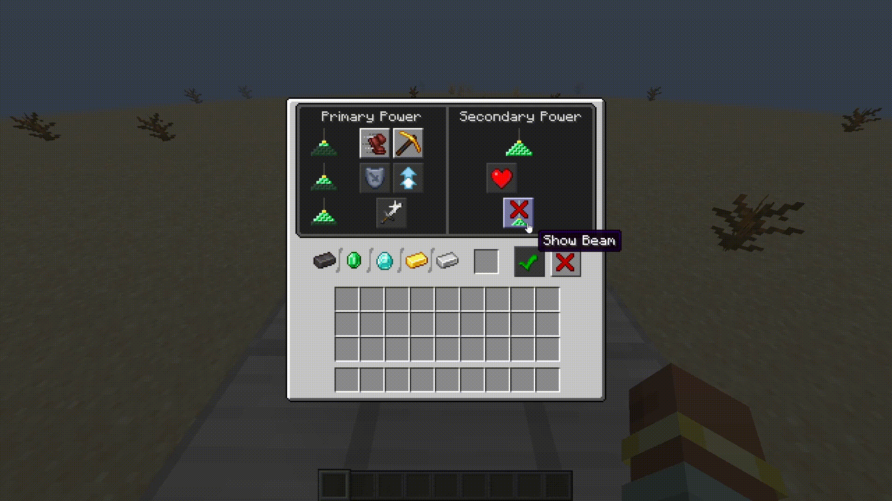

# Toggle Beacon Beams

### Adds a simple beacon beam toggle button to the beacon UI!

- **A simple toggle button within the beacon UI to turn individual beacon beams on and off**
- **Config toggle to hide all beacon beams client-side**
- **Full multiplayer support, with synced toggles when installed on both the client and server**
- **Without the server-side mod, toggles now automatically fall back to client-only mode!**

#### For any issues or feature requests, please make a report on [GitHub](https://github.com/CoolAid48/Toggle-Beacon-Beams/issues)

## Looking for a server host?

